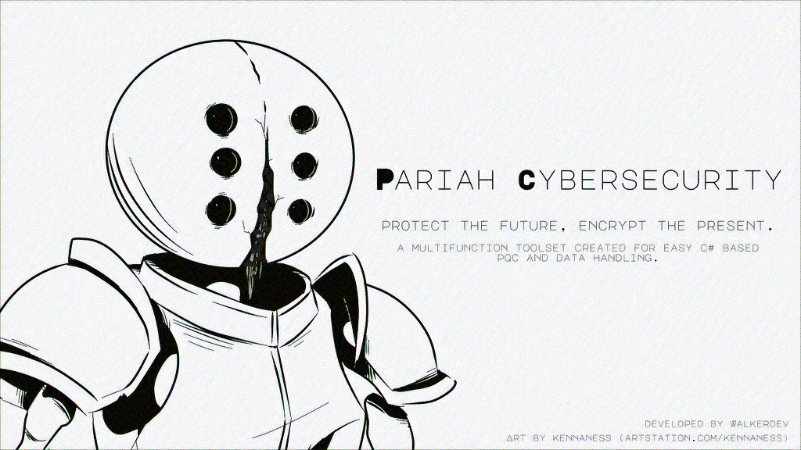
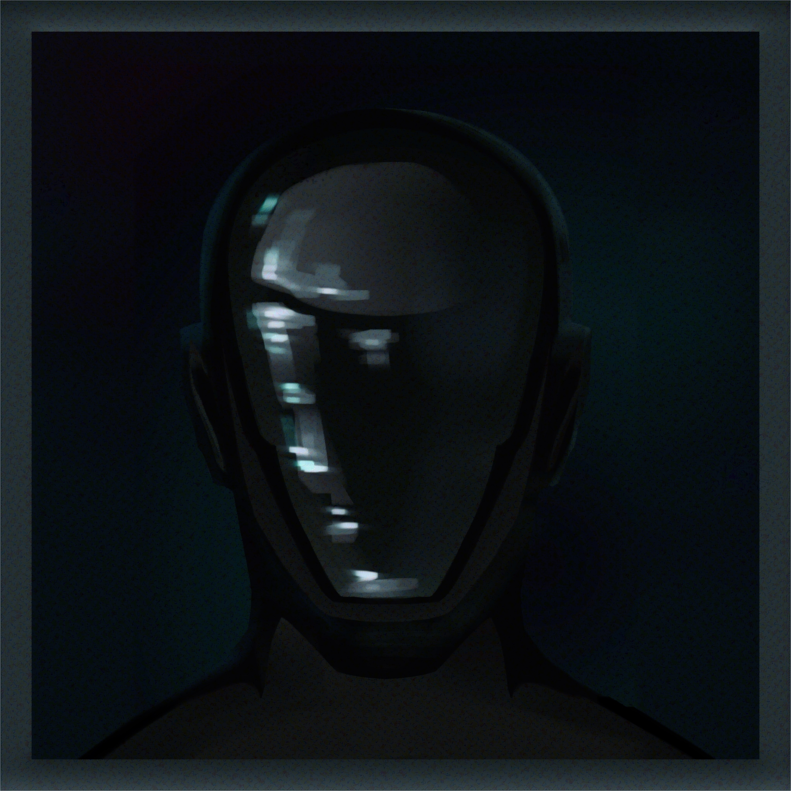

[](https://walkerdev.itch.io/project-replicant)



## What is Pariah Cybersecurity?

Pariah Cybersecurity is a .NET 8.0 Based Library. Primarily developed for programs like the XRUIOS, Project Replicant and Database Designer, it contains a suite of tools meant to make development both easy and secure for developers of all levels!

This is fully open source and free forever! It was made to target Windows, Linux and MacOS!

## View the wiki  
[Welcome to Pariah Cybersecurity Wiki](https://walker-industries-rnd.github.io/PariahCybersecurity/PariahCybersecWiki/Welcome%20To%20Pariah%20Cybersecurity.html)

<div style="white-space: nowrap;">

<div style="display: inline-block; vertical-align: top; width: 48%; margin-right: 2%;">
  <h3>💻 Code By WalkerDev</h3>
  <br>
  "Loving Coding Is Intrinsically The Same As Hating Yourself"<br>
  <a href="https://discord.gg/H8h8scsxtH">&gt; His Discord</a>
</div>

<div style="display: inline-block; vertical-align: top; width: 48%;">
  <h3>🎨 Art By Kennaness</h3>
<br>
  "When Will I Get My Isekai"<br>
  <a href="https://bsky.app/profile/kennaness.bsky.social">&gt; Her Bluesky</a>
</div>

</div>

<br>
<br>

<br>

[Learn More About Walker Industries!](https://walkerindustries.xyz)

[Join the Discord!](https://discord.gg/H8h8scsxtH)

[Support Me on Patreon!](https://www.patreon.com/walkerdev)

[Keep Up With Kennaness' Art Process!!](https://www.artstation.com/kennaness)


(Note, there are many comments all around; you'll see as time continued they decreased in quality and quantity. I plan on adding more comments again at a later time, but I currently have other projects I would like to focus on! Everything should be fine to use in production!)


## What's Included?

🔐 Walker.Crypto.Keys.AsyncAESEncryption - Easy To Use AES256-GCM Based Encryption 

📄 JSONDataHandler - A Simple Yet Powerful Method Of Writing, Saving and Getting Data

🗝️ SecretManager - A Local Based Secrets Manager

📨 DataRequest - For Creating, Storing and Getting Data Readable By Other Programs Securely

👤 Accounts - A Barebones Example Of A Local Based Account System

🔐 AccountsWithSessions - A Secure, Local Based Account System With Session Verification


And Much, Much More!

Check the [Find The Right Solution For You!](https://walker-industries-rnd.github.io/PariahCybersecurity/PariahCybersecWiki/Look%20At%20These/Find%20The%20Right%20Solution%20For%20You!.html) Page To Learn More! This also acts as the table of contents!  
You Can Also Use [The Pariah's Codex of Autonomous Instruments](https://walker-industries-rnd.github.io/PariahCybersecurity/PariahCybersecWiki/Look%20At%20These/The%20Pariah's%20Codex%20of%20Autonomous%20Instruments.html) To View Almost All Pariah Focused Functions!  
Finally, you can view examples directly within [The Pariah's Grimoire of Applied Functionality](https://walker-industries-rnd.github.io/PariahCybersecurity/PariahCybersecWiki/Look%20At%20These/The%20Pariah's%20Grimoire%20of%20Applied%20Functionality.html)!


## How Do I Use It?

Let's say you have some data you want to save, like

```csharp
var YareliGallery = List<Custom.ImageObj>`
```

With Pariah Cybersecurity, all you have to do is

``` csharp
//Create a new Pariah Object on Disc
await JSONDataHandler.CreateJsonFile(pathToSaveTo, "Yareli Gallery", new JObject {} );
//Load the PariahJSON you just made
var loadedGalleryFile = await JSONDataHandler.LoadJsonFile(pathToSaveTo, "Yareli Gallery");
//Add the gallery list to the PariahJson
var savedGallery = await JSONDataHandler.AddToJson<List<Custom.ImageObj>>(loadedGalleryFile, "Gallery", YareliGallery, Password);
//Save the PariahJSON
await JSONDataHandler.SaveJson(savedGallery);
```

Now, whenever you want to get your variable, all you need to do is use

```csharp
//Load the PariahJson from disc
var loadedGalleryFile = await JSONDataHandler.LoadJsonFile(pathToSaveTo, "Yareli Gallery");
//Get the GalleryFile value
var loadedGallery = await JSONDataHandler.GetVariable<List<Custom.ImageObj>>(loadedGalleryFile, "Gallery", Password);
```

Keep in mind; there are a lot of systems within Pariah. Go to the [[Examples Directory]] and you can see specific examples for the library you'll be using!

## Prerequisites

#### The Following Are Needed To Use All Of Pariah Cybersecurity:

- BouncyCastle.NetCore

- Ceras

- k4os.Compression.LZ4

 - Konscious.Security.Cryptography.Argon2

- Newtonsoft.Json

- Parquet.Net

- EasyCompressor.LZ4

- Data.HashFunction.Blake3

- System.Data.HashFunction.Interfaces


## Changes, Fixes And Future Developments

- [X] Changing SecureString to use a custom char[] or byte[] based system (The current SecureString has a length limit, immediate fix needed)
- [ ] Fix Pack and Unpack File (Not too important since I can use the AESmethod for now, I might outsource help here )
- [ ] Readding one of the disabled signatures to the account with session system (Should still be secure without)
- [ ] Package Dependencies Into Singular DLL
- [ ] Adding more graceful error handling (Ha, like that's happening)
- [ ] Releasing Pariah Cybersecurity's password manager as an example


## Special Thanks

- To Kennaness for helping out between making art, hearing my code crash outs and being my development goddess
- My friends for supporting me through the development process
- The Walker Industries' community on Discord for their support


## License
This project is licensed under the [NON-AI Mozilla Public License Version 2.0](https://raw.githubusercontent.com/non-ai-licenses/non-ai-licenses/main/NON-AI-MPL-2.0).

All images on this page were created by the artist Kennaness and are displayed here with permission.


All artwork displayed on this site was created by the artist Kennaness and is used with express permission.
These images are provided for viewing purposes only.
You may not copy, download, distribute, modify, reproduce, use in AI training or datasets, or republish these images in any form — whether for personal, commercial, or non-commercial purposes.
Use of these images in any machine learning system, dataset, or generative model is strictly prohibited.

Any unauthorized use, including but not limited to reproduction, redistribution, or AI-related use, will  be pursued to the fullest extent permitted under applicable law, including seeking damages, injunctive relief, and legal fees.


