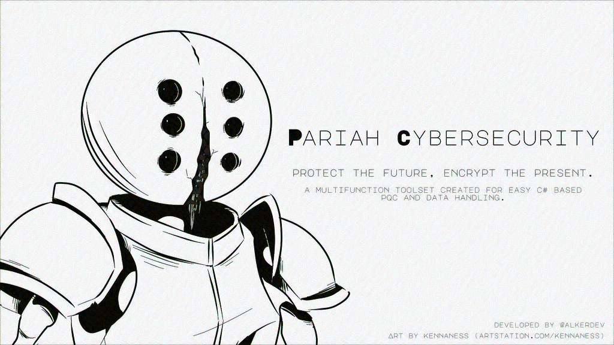
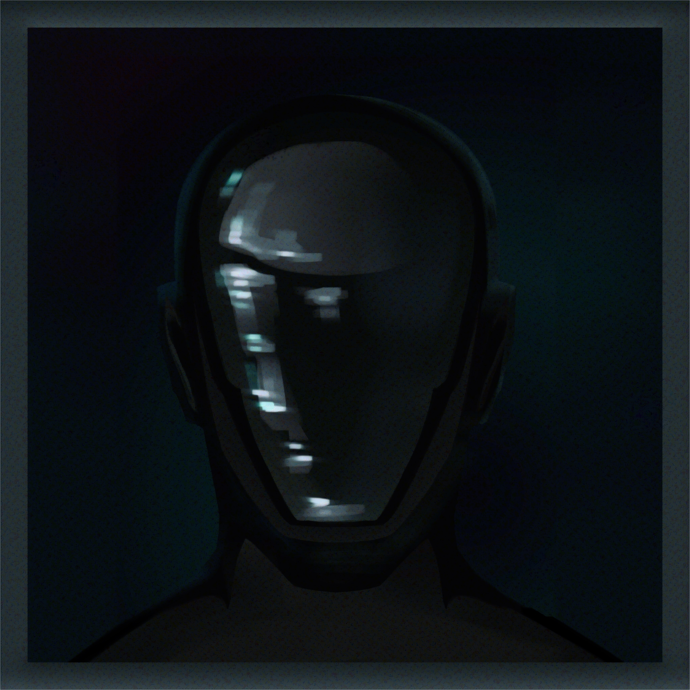

# Pariah Cybersecurity Suite
**High-grade. Local-first. Post-quantum ready. Forever free.**

A complete .NET 8 security framework built for real-world apps — from password managers to distributed systems.  
Built with BouncyCastle, Konscious Argon2, and battle-tested in the fires of XRUIOS, Project Replicant, and Database Designer.  
Now yours to wield.

<p align="center">
  <strong>Windows • Linux • macOS • Fully Offline • No Telemetry • No BS</strong>
</p>

<br>

<div align="center">

|  |  |
|----------------------------------|----------------------------------|
| **Code by WalkerDev**<br>“Loving coding is the same as hating yourself”<br>[Discord](https://discord.gg/H8h8scsxtH) | **Art by Kennaness**<br>“When will I get my isekai?”<br>[Bluesky](https://bsky.app/profile/kennaness.bsky.social) • [ArtStation](https://www.artstation.com/kennaness) |

</div>

<br>


<br>

---
## Watch the v2 Trailer

<div align="center">
  <a href="https://youtu.be/Knm_1H1l3tI">
    
  </a>
</div>

<br>

<p align="center">
  <a href="https://walker-industries-rnd.github.io/PariahCybersecurity/" 
     style="font-size: 1.4em; color: #58a6ff; text-decoration: none;">
    <strong>Documentation • Examples • API Reference</strong>
  </a>
</p>


<p align="center">
  <a href="https://github.com/Walker-Industries-RnD/PariahCybersecurity"><strong>View on GitHub</strong></a> •
  <a href="https://walkerindustries.xyz">Walker Industries</a> •
  <a href="https://discord.gg/H8h8scsxtH">Discord</a> •
  <a href="https://www.patreon.com/walkerdev">Patreon</a>
</p>

---

## What You Get

| Feature                          | Status | Description                                                |
| -------------------------------- | ------ | ---------------------------------------------------------- |
| Walker.Crypto.AsyncAESEncryption | Done   | AES-256-GCM, async, zero allocation paths                  |
| JSONDataHandler                  | Done   | Encrypted, tamper-proof JSON with atomic saves             |
| SecretManager                    | Done   | Local vault with PQC key rotation                          |
| DataRequest                      | Done   | Zero-trust inter-app data sharing + signed root of trust   |
| Accounts                         | Done   | Minimalist local auth with recovery keys                   |
| AccountsWithSessions             | Done   | Full session system with sliding expiry & tamper detection |
| EasyPQC (Kyber + Dilithium)      | Done   | Drop-in post-quantum signatures & KEM                      |
| SecureData                       | Done   | Secrets held AES-encrypted at rest in RAM, page-locked, auto-wiped |
| SecureCache                      | Done   | Fast, cross-platform in-process cache with SecureData values + TTLs |
| AntiTamper                       | Done   | Opt-in anti-debug / anti-injection + wipe-on-detect watchdog |
| HardwareKeyStore                 | Done   | Root key bound to the TPM (Windows) so it can't be exfiltrated |
| File Packing & Compression       | 95%    | LZ4 + Blake3 + forward secrecy                             |
| Merging System                   | ---    | Handles syncing data between sessions                      |

> Full feature matrix → [[Find The Right Solution For You!]]

---

## Quick Start – Save Encrypted Data in 6 Lines

```csharp
var password = "Yuuko".ToSecureData();
var DataBin = new List<ImageObj> { /* ... */ };

// Save
await JSONDataHandler.CreateJsonFile(folder, "AlternativeIV", new JsonObject());
var json = await JSONDataHandler.LoadJsonFile(folder, "AlternativeIV");
json = await JSONDataHandler.AddToJson(json, "Schematics", DataBin, password);
await JSONDataHandler.SaveJson(json);

// Load
var json2 = await JSONDataHandler.LoadJsonFile(folder, "AlternativeIV");
var loaded = await JSONDataHandler.GetVariable<List<ImageObj>>(json2, "Schematics", password);

```


**More real-world examples → [PariahCybersecTest Repository](https://github.com/Walker-Industries-RnD/PariahCybersecTest)**

---

## Cache Secrets Fast — and Protected

`SecureCache` is a fast, cross-platform, in-process cache. Every value is stored as a `SecureData`, so it's AES-encrypted at rest in memory, page-locked, and wiped on eviction/expiry — no extra work on your end.

```csharp
using var cache = new SecureCache(defaultTtl: TimeSpan.FromMinutes(10));

cache.Set("session-token", myToken);          // stored encrypted, expires in 10 min
cache.Set("otp", "839210", TimeSpan.FromSeconds(30)); // per-item TTL

string? token = cache.GetString("session-token");     // null if missing/expired
if (cache.TryGet("session-token", out var protectedCopy)) { /* stays a SecureData */ }
```

> **In-process on purpose.** For a single process this is *faster* than a remote Redis/Garnet server (no network, no serialization), and — critically — your secrets never leave your process's protected memory. A remote cache (Garnet/Redis) is the right call only when the cache must be **shared across processes or machines**; in that case the values live in the server's memory and travel the network, which `SecureData` cannot protect. `SecureCache` implements `ISecureCache`, so a distributed backend can be slotted in behind the same simple API when you actually need it.

---

## Roadmap

| Task                                      | Status       |
|-------------------------------------------|--------------|
| Replace `SecureString` with custom impl   | Done         |
| Remove all default/"Default" keys         | Done         |
| Switch to `System.Text.Json`              | Done         |
| Custom `DataRequest` root path            | Done         |
| Fix final `UnpackFile` edge case          | Done         |
| Release full password manager demo app    | Coming Soon  |

---

## Dependencies (install once)

```bash
dotnet add package BouncyCastle.NetCore  
dotnet add package Ceras  
dotnet add package K4os.Compression.LZ4  
dotnet add package Konscious.Security.Cryptography.Argon2  
dotnet add package Newtonsoft.Json  
dotnet add package EasyCompressor.LZ4  
dotnet add package Data.HashFunction.Blake3  
dotnet add package System.Data.HashFunction.Interfaces

```

> **The memory-protection layer is dependency-free.** `SecureData`, `SecureCache`, `AntiTamper`, and `HardwareKeyStore` are built entirely on .NET's own libraries — `System.Security.Cryptography` (AES / CNG / TPM), `System.Collections.Concurrent`, and P/Invoke to the OS. Nothing extra to install.

## Special Thanks

- **Kennaness** – my development muse, art angel, and emotional support artist
- The Walker Industries Discord – you kept me sane
- The Developer Of The Original SimpleAESEncryption I Used In Unity Long Ago
- Everyone who believed in local-first, open-source, unbreakable security

---

## License & Artwork

**Code:** [NON-AI MPL 2.0](https://raw.githubusercontent.com/non-ai-licenses/non-ai-licenses/main/NON-AI-MPL-2.0)  
**Artwork:** © Kennaness — **NO AI training. NO reproduction. NO exceptions.**


> Unauthorized use of the artwork — including but not limited to copying, distribution, modification, or inclusion in any machine-learning training dataset — is strictly prohibited and will be prosecuted to the fullest extent of the law.
